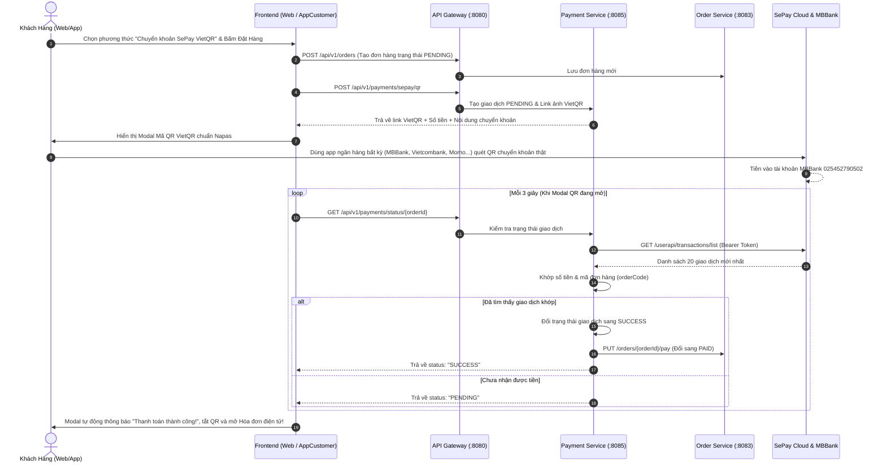

# Hướng Dẫn Luồng Thanh Toán & Cấu Hình IP (Payment Workflow)

Tài liệu này mô tả chi tiết cơ chế hoạt động của **Hệ thống thanh toán trực tuyến SePay VietQR**, giải đáp thắc mắc về **Địa chỉ IP**, và hướng dẫn cách chạy test trên cả **Web** và **Mobile App (AppCustomer)**.

---

## 1. Giải Đáp: "Phần thanh toán có cần địa chỉ IP không?"

Câu trả lời ngắn gọn: **Tùy thuộc vào bạn đang test trên Web hay Điện thoại thật**:

| Nơi chạy / Thiết bị | Có cần IP không? | Giải thích chi tiết |
| :--- | :---: | :--- |
| **SePay Cloud / Ngân hàng** | ❌ **KHÔNG CẦN** | Hệ thống sử dụng **Cơ chế 2: SePay API Token Polling**. Backend `payment-service` chủ động gọi ra ngoài internet (`https://my.sepay.vn`) để kiểm tra biến động số dư. Do là request outbound nên **KHÔNG CẦN IP tĩnh, KHÔNG CẦN ngrok và KHÔNG CẦN mở port modem**. |
| **Web Customer (`localhost:3001`)** | ❌ **KHÔNG CẦN** | Web chạy trực tiếp trên máy tính nên gọi vào `localhost:8080` bình thường. |
| **App Điện thoại (`AppCustomer`)** | ✅ **BẮT BUỘC CẦN IP LAN** | Khi chạy app trên điện thoại thật qua Expo Go, điện thoại không hiểu `localhost`. Điện thoại bắt buộc phải biết **địa chỉ IP Wi-Fi nội bộ của máy tính** (ví dụ: `10.62.148.11:8080` hoặc `192.168.1.x:8080`) để gọi API tạo mã QR và kiểm tra trạng thái thanh toán. |

---

## 2. Thông Tin Cấu Hình Thanh Toán (Đã Tích Hợp Sẵn)

Các thông số đã được cấu hình trong file `DeliveryFood_BackEnd/.env` và nạp vào `payment-service`:

- **Ngân hàng đối tác:** `MBBank` (Ngân hàng Quân Đội)
- **Số tài khoản nhận tiền:** `025452790502`
- **Chủ tài khoản:** `NGUYEN THAI AN`
- **Cổng thanh toán:** `SePay VietQR`
- **SePay API Token:** `Y1XC6UHBPVRCL390SYZILNKOSB8UMAVX6JNREJQYQTJQDNGEWRGZCHVMFV2OBI9Q`
- **API Endpoint:**
  - Tạo mã QR: `POST /api/v1/payments/sepay/qr`
  - Kiểm tra trạng thái: `GET /api/v1/payments/status/{orderId}`

---

## 3. Cập Nhật IP Cho Mobile Tự Động (Chỉ 1 Lệnh)

Để không phải chỉnh sửa IP bằng tay mỗi khi đổi mạng Wi-Fi, dự án đã cung cấp script `update-ip.js`.

### Cách chạy:
Mở terminal tại thư mục gốc dự án (hoặc thư mục `DeliveryFood_Mobile`) và gõ:

```bash
node update-ip.js
```

### Script này làm gì?
1. 🔍 **Tự động quét mạng Wi-Fi** và lấy IP IPv4 máy tính của bạn (ví dụ `10.62.148.11`).
2. 📱 **Cập nhật AppCustomer:** Tự động sửa `LOCAL_IP` trong `.env` và `GATEWAY_URL` trong `src/api/apiClient.js`.
3. 🛵 **Cập nhật AppShipper:** Tự động sửa `LOCAL_IP` trong `.env` và `BASE_URL` trong `src/lib/apiClient.js`.
4. 🩺 **Kiểm tra Backend:** Ping cổng `8080` để báo ngay cho bạn biết Backend đã bật hay chưa.

---

## 4. Luồng Hoạt Động Của Thanh Toán (End-to-End)



---

## 5. Hướng Dẫn Các Bước Test Thực Tế

### Bước 1: Khởi động Backend
Đảm bảo các microservices đã bật, đặc biệt là:
- `api-gateway` (cổng 8080)
- `order-service` (cổng 8083)
- `payment-service` (cổng 8085)

### Bước 2: Chạy script cập nhật IP
```bash
node update-ip.js
```

### Bước 3: Test trên Web Customer
1. Vào `http://localhost:3001/checkout`.
2. Chọn món, điền thông tin người nhận, chọn **Chuyển khoản SePay VietQR**.
3. Bấm **Đặt hàng** -> Màn hình hiện Popup mã QR kèm số tiền và mã đơn.
4. Mở app ngân hàng bất kỳ trên điện thoại, quét mã QR và xác nhận chuyển tiền.
5. Trong vòng 3 - 5 giây, màn hình tự động chuyển sang trang **Chi tiết đơn hàng** với nhãn **ĐÃ THANH TOÁN (VIETQR SEPAY)** màu xanh lá.
6. Bấm nút **"Xem & In Hóa Đơn Điện Tử"** để xem hóa đơn bán lẻ đầy đủ chi tiết.

### Bước 4: Test trên AppCustomer (Mobile Expo Go)
1. Trong terminal:
   ```bash
   cd DeliveryFood_Mobile/AppCustomer
   npx expo start -c
   ```
2. Dùng điện thoại quét mã QR Expo để mở app.
3. Thêm món vào giỏ -> Vào Checkout.
4. Chọn **Thanh toán chuyển khoản (SePay VietQR)**.
5. Bấm Đặt hàng -> Modal mã QR hiện lên trên màn hình điện thoại.
6. Quét mã QR chuyển khoản -> App tự động phát hiện đã thanh toán thành công và hoàn tất đơn hàng!

---

## 6. Xử Lý Các Sự Cố Thường Gặp (Troubleshooting)

### 1. App trên điện thoại báo "Lỗi kết nối / Network Error":
- **Nguyên nhân:** Điện thoại và máy tính không chung mạng Wi-Fi, hoặc chưa chạy script cập nhật IP.
- **Khắc phục:**
  1. Kết nối điện thoại vào cùng mạng Wi-Fi với máy tính.
  2. Chạy lại `node update-ip.js`.
  3. Bấm phím `r` trên terminal Expo để tải lại ứng dụng.

### 2. Quét QR chuyển tiền rồi nhưng màn hình vẫn báo "Đang chờ thanh toán":
- **Nguyên nhân:**
  1. Khi chuyển khoản, ngân hàng có thể mất 5 - 15 giây để xử lý giao dịch Napas 24/7.
  2. Nội dung chuyển khoản bị sửa đổi (Mã đơn hàng bị thiếu).
- **Khắc phục:**
  - Luôn giữ nguyên **Nội dung chuyển khoản** mà mã QR tự động điền sẵn (ví dụ `ORD-1790577513`).
  - Kiểm tra xem token SePay trong `DeliveryFood_BackEnd/.env` có đúng không.

### 3. Xem hóa đơn điện tử ở đâu?
- **Khách hàng:** Vào trang *Chi tiết đơn hàng* (`/orders/{id}`) -> Bấm **"Xem & In Hóa Đơn Điện Tử"**.
- **Cửa hàng (Shop):** Vào *Shop Dashboard* -> Tab **"Hóa đơn bán hàng"** (`/shop/invoices`) để xem danh sách toàn bộ hóa đơn, lọc theo trạng thái thanh toán và bấm in trực tiếp.
